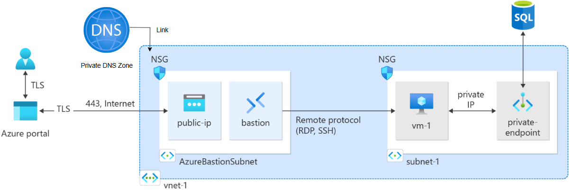

# Azure SQL Private Infrastructure with VM Client

This architecture sets up a secure, private Azure SQL Database environment, along with a Virtual Machine (VM) that connects to the SQL Server via a private endpoint within the same virtual network.

---

## 🌐 Components

## 1. Resource Group
- **Name**: Defined by `var.resource_group_name`
- **Purpose**: Logical container for all Azure resources

## 2. Virtual Network (VNet)
- **CIDR**: `10.0.0.0/16`
- **Purpose**: Isolated network boundary

## 3. Subnet
- **CIDR**: `10.0.0.0/24`
- **Purpose**: Hosts the private endpoint and the VM

## 4. Azure SQL Server & Database
- **SQL Server Name**: `example-sqlserver123`
- **Database Name**: `exampledb`
- **Authentication**: SQL Authentication with administrator login
- **SKU**: `S0` (General-purpose tier)

## 5. Private DNS Zone
- **Zone Name**: `privatelink.database.windows.net`
- **Purpose**: Allows private name resolution of the SQL Server

## 6. Private Endpoint for SQL Server
- **Connected To**: Subnet in the VNet
- **DNS Resolution**: Integrated with the private DNS zone for internal lookup

## 7. Virtual Machine (Client)
- **OS**: Ubuntu LTS (customizable)
- **NIC**: Connected to the same subnet as the SQL Server's private endpoint
- **Use**: Host an application or testing tool to connect to SQL Server privately

## 8. Azure Bastion (Secure Access)
- **Subnet**: Dedicated subnet `AzureBastionSubnet` (e.g., `10.0.1.0/27`)
- **Public IP**: Azure-managed static IP (Standard SKU)
- **Use**: Enables browser-based SSH/RDP to private VMs without exposing public IPs

> It is recommended not to use a NSG for the Azure Bastion subnet, but if you do, ensure it is configured correctly.  
> [Microsoft Docs Reference](https://learn.microsoft.com/en-us/azure/bastion/bastion-nsg)

## 9. Network Security Groups (NSGs)
- **Purpose**: NSGs are used to control inbound and outbound traffic to network interfaces (NICs), subnets, or both.
- **Usage**:
  - One NSG (`nsg-bastion`) is attached to the **Azure Bastion subnet** to allow secure management access.
  - Another NSG (`nsg_private`) is associated with the **private subnet** hosting the VM and private endpoint, restricting access to only trusted sources (e.g., Bastion subnet).
- **Best Practice**: Use NSGs to enforce least privilege access, ensuring only necessary traffic is allowed in and out of your subnets and resources.

---

## 🔒 Security

- No public IP is used for the SQL Server or VM
- Private DNS zone ensures SQL Server is not publicly resolvable
- Azure Bastion ensures secure remote access via browser
- SQL traffic remains entirely within Azure’s backbone network

---

## 🧪 Use Cases

- Internal Line-of-Business applications
- Secure data processing platforms (e.g., finance or healthcare)
- Hybrid cloud environments with ExpressRoute/VPN
- Dev/Test environments with production-like networking

---

## 🛠️ Next Steps

- Configure VM with SQL client tools or custom applications
- Use **Azure Bastion** for secure remote access via Azure Portal
- Monitor using Azure Monitor or Log Analytics

---

This architecture provides a solid foundation for building secure and scalable internal applications that need a managed SQL backend without public exposure. Setup an Azure private DNS Zone for a private endpoint:
https://learn.microsoft.com/en-us/azure/dns/private-dns-getstarted-portal
#### Note: The required 'name' for use with a private endpoint - https://registry.terraform.io/providers/hashicorp/azurerm/latest/docs/resources/private_dns_zone 


Deploy this architecture via the portal here - https://learn.microsoft.com/en-us/azure/private-link/tutorial-private-endpoint-sql-portal


# Installing SQL Server Command-Line Tools (`sqlcmd` and `bcp`) on Ubuntu 22.04

This guide provides the steps to install Microsoft SQL Server command-line tools on a Linux system running Ubuntu 22.04.

---

## ✅ Prerequisites

- Ubuntu 22.04 system
- Sudo privileges
- Internet access

---

## 🛠️ Installation Steps

### 1. Import the Microsoft GPG Key

```bash
curl https://packages.microsoft.com/keys/microsoft.asc | sudo apt-key add -
````

> ⚠️ Note: You might see a deprecation warning for `apt-key`. This is expected and can be ignored for now.

---

### 2. Add the Microsoft SQL Server APT Repository

```bash
sudo curl -o /etc/apt/sources.list.d/mssql-release.list https://packages.microsoft.com/config/ubuntu/22.04/prod.list
```

---

### 3. Update the Package List

```bash
sudo apt update
```

---

### 4. Install SQL Server Tools and Dependencies

```bash
sudo ACCEPT_EULA=Y apt install -y mssql-tools18 unixodbc-dev
```

---

### 5. Add SQL Tools to Your Shell PATH

```bash
echo 'export PATH="$PATH:/opt/mssql-tools18/bin"' >> ~/.bash_profile
echo 'export PATH="$PATH:/opt/mssql-tools18/bin"' >> ~/.bashrc
source ~/.bashrc
```

---

### 6. Confirm Installation

```bash
sqlcmd -?
bcp -?
```

If installed correctly, these commands will display the help menus for each tool.

---

## 🔧 (Optional) Set Up Aliases

To make typing easier, you can create aliases:

```bash
echo 'alias sqlcmd="/opt/mssql-tools18/bin/sqlcmd"' >> ~/.bashrc
echo 'alias bcp="/opt/mssql-tools18/bin/bcp"' >> ~/.bashrc
source ~/.bashrc
```

---

## ✅ You’re Done!

You now have `sqlcmd` and `bcp` installed on Ubuntu 22.04.
You can begin using these tools to connect and interact with your Microsoft SQL Server.


# To log into SQL server

```bash
sqlcmd -S <server-name>.database.windows.net -U '<username>' -P '<password>'
```

# Alternatively To use az login --identity

```bash
curl -sL https://aka.ms/InstallAzureCLIDeb | sudo bash
```

```bash
az login --identity --allow-no-subscriptions
username=$(az keyvault secret show --vault-name dstsqlkeyvault --name sql-admin-username --query value -o tsv)
password=$(az keyvault secret show --vault-name dstsqlkeyvault --name sql-admin-password --query value -o tsv)

sqlcmd -S your-server-name.database.windows.net -U "$username" -P "$password"
```

## If successful, you’ll see the prompt: 
```bash
1>
```
## example SQL commands
```sql
1> SELECT name FROM sys.databases;
2> GO
```
 ## output:
 ```markdown
 name                                                                                                                            
--------------------------------------------------------------------------------------------------------------------------------
master                                                                                                                          
exampledb 
```
## To exit:
```sql
EXIT
```

